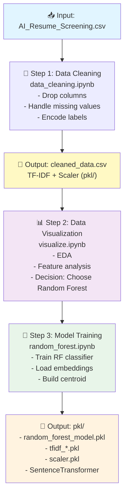
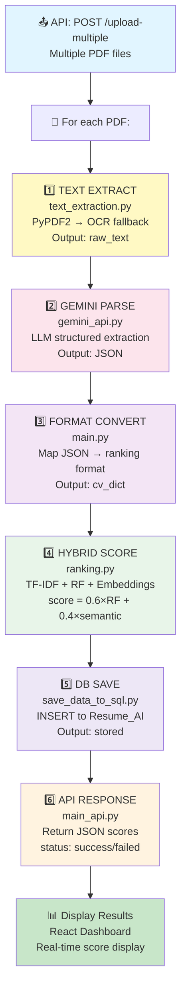
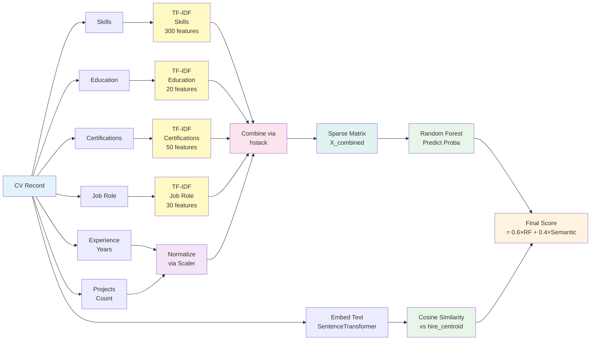

# Training & Inference Pipeline Architecture

## Stage 1: Model Training (One-time)



## Stage 2: Real-time Inference (Production)



## Detailed Feature Engineering



## Folder Structure

```mermaid
graph TD
    A["📁 AI for CV_Score"]
    
    A --> B["🎯 Training Phase"]
    B --> B1["data/<br/>AI_Resume_Screening.csv"]
    B --> B2["data_cleaning.ipynb"]
    B --> B3["visualize.ipynb"]
    B --> B4["random_forest.ipynb"]
    B --> B5["logistic_regression.ipynb<br/>(alternative)"]
    B --> B6["cleaned_data.csv<br/>(output)"]
    
    A --> C["💾 Models"]
    C --> C1["pkl/"]
    C1 --> C1A["random_forest_model.pkl"]
    C1 --> C1B["tfidf_skills.pkl"]
    C1 --> C1C["tfidf_edu.pkl"]
    C1 --> C1D["tfidf_cert.pkl"]
    C1 --> C1E["tfidf_job.pkl"]
    C1 --> C1F["scaler.pkl"]
    C1 --> C1G["X_sparse.pkl, y.pkl"]
    
    A --> D["⚙️ Inference Pipeline"]
    D --> D1["main_api.py<br/>(FastAPI backend)"]
    D --> D2["main.py<br/>(main logic)"]
    D --> D3["text_extraction.py"]
    D --> D4["gemini_api.py"]
    D --> D5["ranking.py"]
    D --> D6["save_data_to_sql.py"]
    
    A --> E["🌐 Frontend"]
    E --> E1["src/"]
    E1 --> E1A["App.jsx"]
    E1 --> E1B["components/"]
    E1B --> E1B1["Sidebar.jsx"]
    E1 --> E1C["pages/"]
    E1C --> E1C1["Home.jsx"]
    E1C --> E1C2["Dashboard.jsx"]
    E1C --> E1C3["History.jsx"]
    E --> E2["package.json"]
    E --> E3["vite.config.js"]
    
    A --> F["🗄️ Database"]
    F --> F1["SQL Server<br/>Resume_AI"]
    F --> F2["CV_save_to_sql.sql<br/>(schema)"]
    
    A --> G["📚 Config"]
    G --> G1["env.txt<br/>(environment)"]
    G --> G2["PIPELINE.md<br/>(this doc)"]
    
    A --> H["🧪 Testing"]
    H --> H1["TestDriver.py"]
    
    style A fill:#fff9c4
    style B fill:#e1f5ff
    style C fill:#fff3e0
    style D fill:#fce4ec
    style E fill:#e8f5e9
    style F fill:#ede7f6
